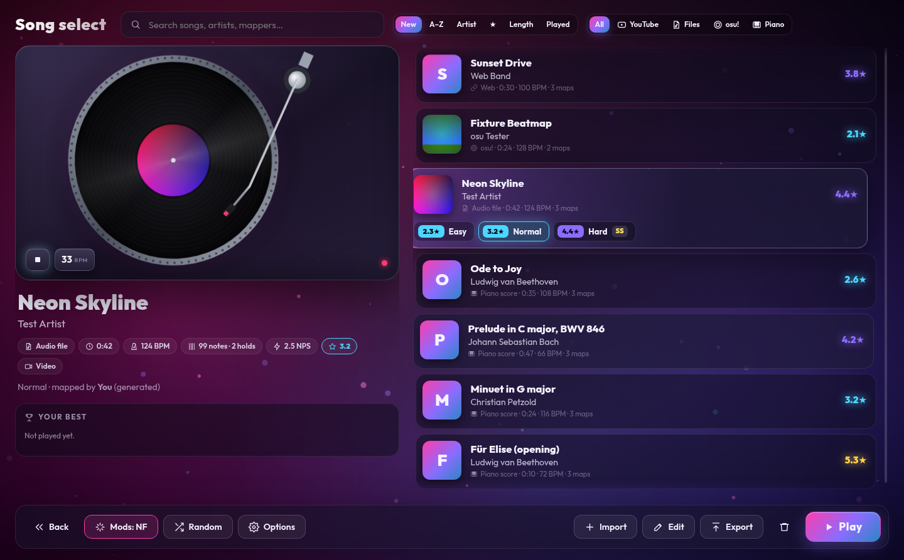
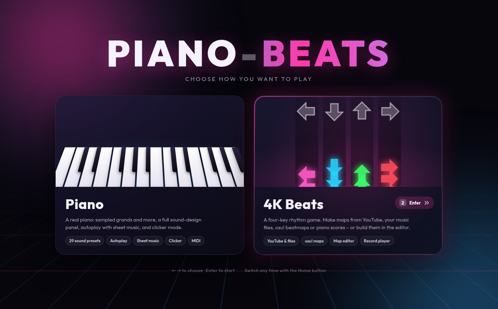
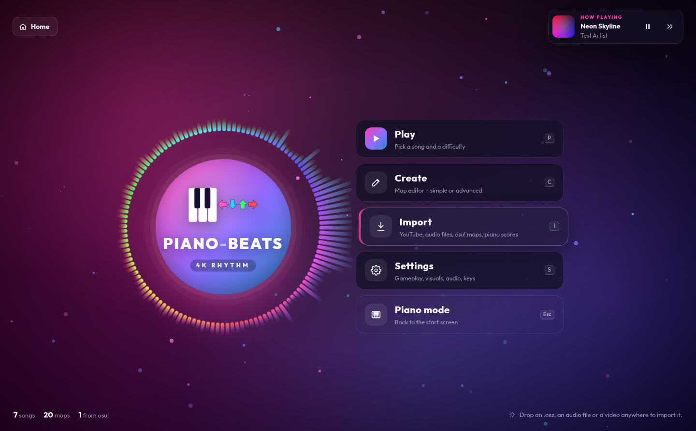
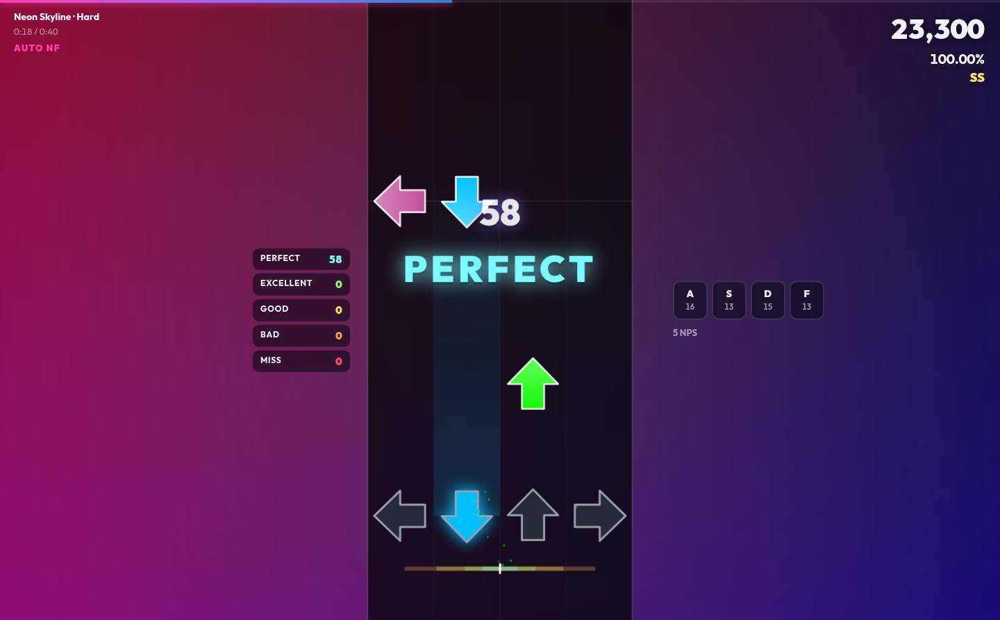
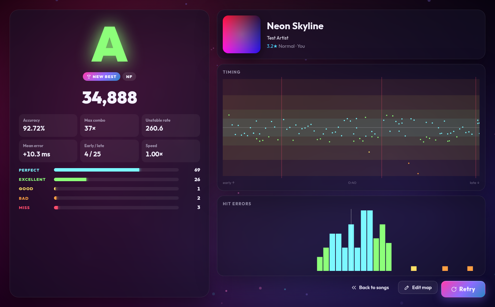
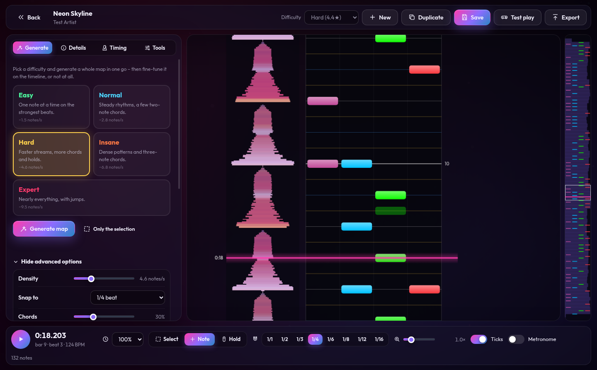
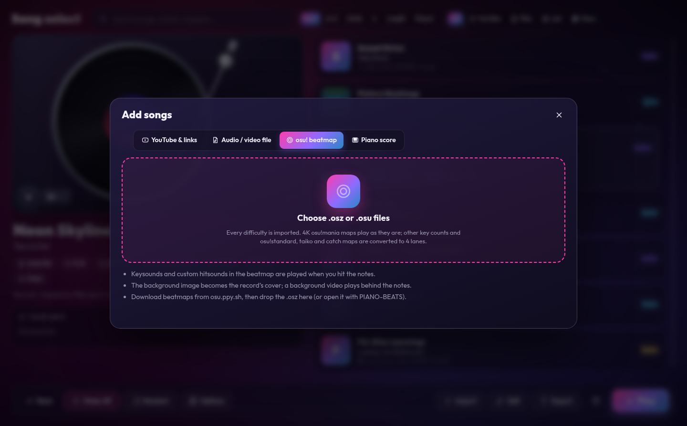

# PIANO-BEATS

A desktop piano **and** a four-key rhythm game, for Windows, macOS and Linux. After the loading screen you choose where to go; the logo (or **Home**) brings you back.

**Piano**

- **Sampled instruments streamed from the internet.** Steinway, Yamaha and Kawai grands, uprights, electric pianos, harpsichord, organs and mallets, with multiple velocity layers. Samples are cached on disk, so each instrument downloads once.
- **A full sound-design panel** covering touch, voicing, dampers, pedals, tuning and temperaments, EQ, room reverb, stereo, effects and dynamics.
- **An autoplayer** for MusicXML, MXL, MIDI and ABC files, with speed control, A–B loops, per-hand practice and a "wait for me" mode.
- **Score search.** Almost 900 classical works are bundled in an offline catalogue, and BitMidi, the Mutopia Project and The Session can be searched online.
- **Sheet music** for every file, and **clicker mode** (Flow or Tap tempo).

**4K Beats**

- **Songs from anywhere:** YouTube (search, or paste a link), audio and video files, osu! beatmaps (.osz/.osu) and piano scores (the same search as the piano).
- **Automatic maps:** PIANO-BEATS listens to the song (beats, tempo, onsets, sustains) and makes maps from Easy to Expert.
- **A map editor** that is as simple or as detailed as you like: generate with a preset, tune every generator setting, or place every note and hold by hand on a beat-snap timeline over the waveform.
- **A record player** on the song screen with the song's cover on the label. It plays the preview; grab it to scratch.
- **Gameplay** with arrows, bars, circles or diamonds; Perfect / Excellent / Good / Bad / Miss judgements, accuracy, combo, score, grades, unstable rate and a timing graph; background videos; mods; and a long list of settings.
- **Export to osu!** as an osu!mania 4K .osz.



| Start screen | 4K main menu |
| --- | --- |
|  |  |
| **Playing (background video)** | **Results** |
|  |  |
| **Map editor** | **Importing** |
|  |  |
| **Piano: autoplay with sheet music** | **Piano: sound settings** |
|  |  |
| **Piano: falling notes** | **Piano: score search** |
|  |  |

---

## Getting started

You need [Node.js](https://nodejs.org) 20 or newer.

```bash
npm install
npm start          # build the UI and launch the desktop app
```

For development with hot reload:

```bash
npm run dev
```

### Building installers

```bash
npm run dist:win    # Windows: NSIS installer + portable .exe
npm run dist:mac    # macOS: .dmg
npm run dist:linux  # Linux: AppImage + .deb
```

Installers are written to `release/`. You can also push a tag such as `v1.0.0`. The **Build installers** GitHub Actions workflow then builds all three platforms and attaches them to a GitHub release. You can start the same workflow by hand from the Actions tab.

> The macOS build is not code-signed. The first time you open it, right-click the app and choose **Open**.

---

## Playing

| Input | How it works |
| --- | --- |
| **Computer keyboard** | Two rows like a tracker. `Z`–`M` is the lower octave, with sharps on `S D G H J`. `Q`–`P` is the upper octave, with sharps on `2 3 5 6 7 9 0`. A single-row layout (`A S D F…`) is available in settings. |
| **Mouse / touch** | Click or tap the on-screen keys. Striking nearer the front of a key plays louder. Drag across the keys for a glissando. Multi-touch works. |
| **MIDI keyboard** | Plug one in at any time. Velocity, sustain (CC64, including half-pedalling), sostenuto (CC66) and soft pedal (CC67) all work. |
| **Pedals** | Hold `Space` (in free play) or `Shift` for sustain. You can also click the pedal buttons above the keyboard to latch them. |

The panic key is `Esc`. `←`/`→` change the octave and `↑`/`↓` change the keyboard velocity. `F1` lists every shortcut.

### Layout

Everything folds away so the music gets the screen:

| Part | How to open or close it |
| --- | --- |
| Library, search and score details | The icons on the left rail, or `Ctrl+B` |
| Sound settings | The icon on the right rail, or `Ctrl+,`. Each section folds on its own, and **Collapse all** folds them all. |
| Keyboard | The **Keyboard** button above it, or `Ctrl+K`. Folded, it becomes a thin strip that still lights up the notes. |
| Transport options (loop, count-in, wait for me, clicker options) | **Options** in the bottom bar |
| Everything at once | The eye icon in the top bar, or `Ctrl+.` (focus mode) |

Play/pause, the timeline and speed are in the bar at the bottom of the window.

## Instruments & presets

All instruments are free sample libraries hosted on GitHub. PIANO-BEATS downloads the samples the first time you pick an instrument and tries a mirror if one host fails. The middle of the keyboard loads first, so you can start playing within a second or two. **Sample quality** (Full, Balanced or Light) controls how many velocity layers are downloaded. With no internet connection, the synthesized piano, electric piano and organ still work.

| Category | Instruments |
| --- | --- |
| Grand pianos | Splendid Grand (Steinway D, 4 layers), Salamander Grand (Yamaha C5), Steinway B (separate pedal-up/pedal-down samples), Kawai Grand, MusyngKite Grand, FluidR3 Bright Grand |
| Upright pianos | Yamaha Upright, Knight Upright (sampled pedal & key mechanics), Honky-tonk |
| Electric pianos | Wurlitzer EP200, Yamaha CP-80, Hohner Pianet T, Tine EP, FM EP, TX81Z |
| Keys & mallets | Flemish Harpsichord, Clavinet, Celesta, Music Box, Vibraphone, Marimba, Glockenspiel, Toy Keyboard |
| Organs | Pipe Organ, Full Church Organ, Drawbar Organ |
| Offline | Synth Piano, FM Tine Piano, Drawbar Organ |

There are 29 factory presets, for example *Concert Grand*, *Felt Piano*, *Lo-fi Keys*, *Honky-Tonk Saloon*, *Suitcase Tines* and *Baroque Harpsichord*. The Baroque Harpsichord preset uses A = 415 Hz and Werckmeister III tuning. You can save your own presets and export or import them as `.json`.

### Sound parameters

| Section | Parameters |
| --- | --- |
| Touch & velocity | Touch curve (light / normal / linear / heavy / fixed), fixed velocity, dynamic range |
| Tone & EQ | Brightness, hammer hardness (velocity-to-timbre), lid position, 3-band EQ with sweepable mid |
| Envelope & dampers | Attack, damper release time, sustain decay, repeated-note behaviour (re-strike cuts or overlaps) |
| Pedals & mechanics | Half-pedalling, sympathetic string resonance, pedal noise, key-release noise, una corda amount |
| Tuning & temperament | A4 reference (415–466 Hz), transpose, fine tune, 8 temperaments with selectable key, stretch tuning, unison detune |
| Room & stereo | 7 reverb rooms (room, studio, chamber, hall, cathedral, plate, spring), amount, RT60, pre-delay, air damping, stereo width, key panning |
| Effects | Tremolo / stereo auto-pan, chorus, drive |
| Dynamics & engine | Compressor (threshold, ratio), output limiter, polyphony |

The piano engine also switches velocity layers, cycles round-robin samples, and leaves the top strings undamped the way a real piano does. It has sostenuto, a metronome with tap tempo, and records what you play to MIDI and WAV.

## Scores

**Open** files with *Open file…* or `Ctrl+O`, drag and drop them onto the window, or double-click one in your file manager (file associations are set up by the installer). **From URL…** loads any direct link. PIANO-BEATS reads:

- MusicXML (`.musicxml`, `.xml`) and compressed MusicXML (`.mxl`), including repeats, voltas, D.C./D.S./Fine/Coda, ties, grace notes, tempo changes, dynamics and hairpins, articulations, arpeggios and pedal marks.
- MIDI (`.mid`, `.midi`, `.kar`), including tempo maps and pedal controllers. Zipped multi-movement MIDI downloads also open.
- ABC (`.abc`), including files that contain many tunes; you can pick the tune under **Score**.

**Search** has these sources:

| Source | What | Format |
| --- | --- | --- |
| Classical piano (ASAP) | 235 engraved piano works (Bach, Beethoven, Chopin, Liszt, Mozart, Rachmaninoff, Ravel, …) | MusicXML, bundled index |
| music21 corpus | 650 scores (Bach chorales, Joplin, quartets, …) | MusicXML, bundled index |
| BitMidi | 100,000+ MIDI files | MIDI, online |
| Mutopia Project | 2,000+ public-domain classical scores | MIDI, online |
| The Session | Irish and folk tunes | ABC, online |

Scores you open are saved in your **library**, so they also open offline.

### Autoplay

Autoplay has play/pause, seek, speed from 25 % to 200 %, A–B loop and whole-piece loop, a count-in, and a metronome that follows the score. It also uses the score's pedal marks.

To practise one hand, switch off **LH** or **RH** and play that hand yourself. Its notes are shown as hints. With **Wait for me** on, playback stops at each of that hand's chords until you play them.

### Sheet music

Use the **Sheet** or **Split** view. The cursor follows playback, and clicking a note jumps there. MIDI and ABC files are turned into two-staff notation: rhythms are quantized to 16ths and triplets, notes are tied across bar lines, sustained notes get a second voice, and the key signature is estimated.

### Clicker mode

A tap can be any key, a mouse click on the notes area or the **TAP** button, or any MIDI key. There are two styles, switched in the bottom bar:

- **Flow** (default): the piece plays exactly like the autoplayer, with written rhythms, note lengths, dynamics and pedalling, as long as you keep tapping. Each tap lets the music continue to the next chord. You can tap up to two chords ahead, so mashing keys never makes it rush. When you stop tapping, it waits at the next chord.
- **Tap tempo**: every tap plays the next chord, so the music follows the speed of your taps. The options are:
  - **Taps play**: both hands, or only the right or left hand. With **Other hand follows** on, the other hand plays along at the tempo you are tapping.
  - **Notes last**: as written (scaled to your tapping speed), while the key is held, or until the next tap.
  - **Loudness**: from the score, from your touch, or fixed.

In both styles, `Backspace` steps back one chord and `Home` restarts.

---

## 4K Beats

Choose **4K Beats** on the start screen. The main menu leads to **Play** (song select), **Create** (the map editor), **Import** and **Settings**. The first time, the bundled piano demos are added with ready-made maps, so there is something to play offline.

### Adding songs

**Import** (or drop files anywhere in the 4K area) has four tabs:

| Source | What happens |
| --- | --- |
| **YouTube & links** | Search YouTube, or paste a YouTube, SoundCloud, Bandcamp or direct media link. The audio (and, if you like, the video for the background, up to the quality you choose) is downloaded with [yt-dlp](https://github.com/yt-dlp/yt-dlp). PIANO-BEATS downloads yt-dlp itself the first time (about 40 MB), keeps it up to date from *Settings → Library*, and uses its own Electron runtime for YouTube's JavaScript checks, so nothing else has to be installed. Title and artist come from the video ("Artist – Title (Official Video)" is cleaned up). |
| **Audio / video file** | MP3, OGG, Opus, WAV, FLAC, M4A, or an MP4/WebM/MOV video (its audio is used and the video plays in the background). Title, artist, album and cover art are read from ID3, FLAC and MP4 tags. |
| **osu! beatmap** | An .osz (every difficulty) or .osu file. 4K osu!mania maps play exactly as mapped. Other key counts are folded onto four lanes, and osu!standard, taiko and catch maps are converted: lanes from position or drum colour, sliders and spinners become holds. The background image, background video and keysounds or custom hitsounds come along. You can also open .osz files with PIANO-BEATS from your file manager. |
| **Piano score** | Search the classical catalogue and online sources, pick from your piano library, or open a MusicXML/MXL/MIDI/ABC file. Score songs are played on the piano: each note you hit plays the melody notes it stands for, and the accompaniment plays along. |

New songs are analysed and get maps straight away (Easy, Normal and Hard by default; choose which in the dialog). You can go straight into the editor afterwards (*Settings → Library*).

**Cover art** for the record player comes from the video's YouTube thumbnail, the file's embedded picture or the beatmap's background. If there is none, PIANO-BEATS searches Google Images for the artist and title and uses the first image, falling back to iTunes and Deezer album art. You can also pick an image yourself in the editor.

### How maps are made

The audio is resampled to 22 kHz and analysed in a background worker:

- **Onsets:** log-compressed spectral flux in four frequency bands, peak-picked against an adaptive threshold, with sub-frame timing. On test material, detected hits are within about 2 ms of the real ones.
- **Tempo and beat grid:** autocorrelation of the onset envelope with a prior around 120 BPM, then a comb fit over the whole song for the exact BPM and phase. The downbeat is taken from the low band.
- For each onset, its strength in the bass, mid and high bands, its brightness (used as the "pitch" that lanes follow) and how long it sustains.

The generator then snaps onsets to the beat grid, picks the strongest ones while keeping the density you asked for (quiet passages get sparser with *dynamics*), assigns lanes with the chosen pattern (following the melody's contour, and avoiding jacks that are too fast), adds chords on strong, thick moments and holds on long notes, and makes sure holds end before the next note in their lane. Piano scores use the same generator, driven by the score's notes, beats and velocities.

### The map editor

Open it with **Create** in the menu, **Edit** on the song screen (`Ctrl+E`) or **Edit map** on the results screen.

- **Generate** – *simple*: pick Easy, Normal, Hard, Insane or Expert and press **Generate map**. *Advanced*: density (notes per second), snap (off, 1/1–1/8), chords and largest chord, holds and shortest hold, fastest repeat in a lane, pattern style (flow, stairs, trills, jumps, random), how closely lanes follow the pitch, sensitivity, what to listen to (everything, drums, melody, bass) or which hands (scores), dynamics, mirror and a variation seed. **Only the selection** regenerates just the selected part.
- **Timeline** – the song's colour-coded waveform (or piano roll for scores) beside the four lanes, with bar, beat and snap lines coloured by division. Tools: **Select** (click, Shift-click, box-select, drag to move in time and across lanes), **Note** (click a lane) and **Hold** (drag). Right-click deletes. `Ctrl+C`/`X`/`V` copy, cut and paste at the playhead; `H` mirrors; `Ctrl+Z`/`Y` undo and redo. While the song plays, the lane keys (`D F J K` by default) place notes at the playhead, so you can map by playing along. Playback speed 25–100 %, tick sounds on notes, metronome, zoom, and a minimap of the whole song.
- **Details** – the song's title, artist, tags, cover, background video (and its offset) and preview point; the difficulty's name, mapper, description, star rating (estimated or set by hand), OD and HP.
- **Timing** – BPM, offset and beats per bar, the detected values, tap tempo, ×2/÷2, extra timing points, and "snap all notes to the grid".
- **Tools** – statistics, mirror all, holds to taps, shift every note, clear.
- **Test play** (`F5`) starts the map from the cursor and comes back to the same spot. **Save** with `Ctrl+S`; **New** and **Duplicate** add difficulties.

### Song select and the record player

The song list can be searched (just start typing), sorted (newest, title, artist, difficulty, length, most played) and filtered by source. The selected song shows its difficulties with star ratings and your grades, and your five best plays of the selected map.

The record player spins the song's preview (the loudest part of the song, or the preview point you set) with the cover as its label. **Grab the record and move it to scratch**: the audio follows your hand, backwards too, with needle noise when you move it fast. Let go and the motor brings it back up to speed. The buttons start and stop the motor and switch between 33⅓ and 45 rpm. The background takes on the colours of the cover.

Keys: `↑`/`↓` song, `←`/`→` difficulty, `Enter` play, `F1` mods, `F2` random, `F3` settings, `Ctrl+E` edit, `Del` delete.

**Export** saves the song's difficulties as an osu!mania 4K .osz: the audio as MP3 (score songs are rendered on the piano first), the cover as background, the video if you want, and keysounds. Tick *Open it with osu! afterwards* to import it into osu! straight away.

### Playing

`A S D F` by default, plus the arrow keys as alternates. MIDI keyboards (any four neighbouring white keys, or C D E F) and touch or mouse on the lanes work too.

| Judgement | Window (normal) | Accuracy |
| --- | --- | --- |
| Perfect | ±25 ms | 100 % |
| Excellent | ±50 ms | 90 % |
| Good | ±90 ms | 65 % |
| Bad | ±135 ms | 30 % |
| Miss | later, or not hit | 0 % |

Windows are in real time, so they stay the same at any speed. They can be lenient (×1.35), strict (×0.7) or use the map's osu!mania OD. The results show the grade (SS for all perfect, then S, A, B, C, D, or F for failing), score, accuracy, max combo, unstable rate, mean error, early/late counts, a timing graph over the song and a histogram of hit errors.

During play: `Esc` pauses (then `R` restart, `Q` quit), hold `` ` `` to restart instantly, `−`/`=` nudge this map's offset, and `Space` skips a long intro.

**Mods** (`F1`): song speed 0.5–2× (with or without keeping the pitch), mirror, random lanes, no holds, hidden, fade in, auto (watch it play), and health: normal, no fail, sudden death or perfect only.

**Settings** (`F3`, or from the menu or the pause screen):

- *Gameplay*: scroll speed and direction (downscroll like osu! or upscroll like FNF), note skin (arrows, bars, circles, diamonds), note colours (by lane, by beat snap, or one colour) and palette, hit position, lane width, lane cover, timing windows, health, audio offset with a tap calibration, countdown, skipping intros, pausing when the window loses focus, keeping the pitch.
- *Display*: background dim and blur, background video, lane darkness, and each part of the HUD (judgements and their position, early/late, combo, hit error bar, key overlay, score, health, progress, notes per second, FPS), hit lighting, particles, bar lines, shake on miss.
- *Audio*: master, music, hitsound, keysound and effect volumes; hitsound (none, soft, tick, clap, kick, drum or piano); keysounds of osu! maps; miss sound; menu music; previews; record crackle.
- *Input*: lane keys and presets, alternate keys, quick-retry key and hold time, offset keys, MIDI mapping, touch.
- *Library*: your mapper name, background video downloads and quality, yt-dlp version and update, the songs folder.
- *Interface*: accent colour, menu visualizer, reduced motion, reset.

---

## Where things are stored

| What | Location |
| --- | --- |
| Downloaded samples, scores and search cache | `<userData>/cache` (open it from *Help → Open Sample Cache Folder*; clear it in settings) |
| Library | `<userData>/library` |
| 4K songs and maps | `<userData>/beats/songs/<song>/`: `song.json`, `maps/*.json`, the audio, video, cover and keysounds (open it from *4K Settings → Library*) |
| yt-dlp | `<userData>/bin` |
| Settings, presets, 4K scores and offsets | Browser storage inside the app profile |

`<userData>` is `%APPDATA%\PIANO-BEATS` on Windows, `~/Library/Application Support/PIANO-BEATS` on macOS and `~/.config/PIANO-BEATS` on Linux. An existing `PianoMan` folder from before the rename is moved there on first start, so downloads, library and settings are kept.

## Project layout

```
electron/          main process (window, app:// protocol, cached network fetch, dialogs, library) + preload
electron/beats.cjs 4K song library on disk, media:// protocol with range requests, yt-dlp install/search/download
src/audio/         sound engine, instruments, presets, sample loader, tuning, reverb, synth voices, metronome, recorder
src/score/         score model, MusicXML / MXL / MIDI / ABC importers, notation generator
src/player/        autoplayer and clicker mode
src/game/          judgements, scoring and the play session (shared by the 4K game)
src/beats/         4K Beats: data model, store, osu! reader/writer, map generator, tags, web lookups (YouTube, covers)
src/beats/audio/   analysis & time-stretch worker (dsp.ts), offline piano renderer, mixer/clock/record-player deck, scratch worklet
src/beats/ui/      4K screens: menu, song select + record player, import, gameplay, results, editor, settings
src/launcher.ts    start screen; src/shell.ts switches between the two areas
src/search/        search providers and the bundled score index
src/ui/            keyboard, falling notes, sheet view, panels, transport, controls
scripts/           instrument-table, score-index and demo generators; dev launcher
test/              unit tests (npm test)
```

Development commands:

```bash
npm run check                      # typecheck + tests + production build
npm run instruments                # rebuild src/audio/data/sfz-instruments.json from the SFZ libraries
python3 scripts/build-score-index.py
node scripts/build-demos.mjs       # regenerate the bundled demo scores
PIANOMAN_CORPUS=/path/to/scores npx vitest run test/corpus.test.ts   # parse a folder of real files
```

## Troubleshooting

- **No sound:** click the window once, because some systems only start audio after an interaction. Also check the output level meter in the top bar.
- **Instrument shows "Offline fallback":** the sample hosts (`*.github.io`, `raw.githubusercontent.com`) were unreachable. Samples that were already downloaded keep working. Otherwise the synth piano plays until you reconnect; then press **Reload**.
- **MIDI keyboard not listed:** connect it and wait a second, since devices are detected while the app runs. On Linux, your user needs access to ALSA MIDI.
- **Linux AppImage:** run `chmod +x PIANO-BEATS-*.AppImage` first.
- **YouTube downloads fail:** YouTube changes often; press *Update* next to yt-dlp in *4K Settings → Library*. Downloads need yt-dlp's GitHub releases and the video site to be reachable.
- **Notes feel early or late:** use *Calibrate* next to *Audio offset* (4K settings), or nudge a single map with `−`/`=` while playing.
- **No cover art:** the lookups need Google, iTunes or Deezer to be reachable; you can always choose an image in the editor's *Details* tab.

## Credits

Instrument samples (streamed at runtime, not bundled):

- **Splendid Grand Piano**: AKAI (public domain), SFZ by kinwie, hosted by [smpldsnds](https://github.com/smpldsnds)
- **Salamander Grand Piano**: Alexander Holm (CC BY 3.0), via [Tone.js audio](https://github.com/Tonejs/audio)
- **Versilian Community Sample Library** (Steinway B, Kawai, uprights, harpsichord, organ, mallets, TX81Z): Sam Gossner (CC0)
- **Greg Sullivan E-Pianos** (Wurlitzer, CP-80, Pianet): Greg Sullivan (CC BY 3.0)
- **FluidR3 GM** (CC BY 3.0) and **MusyngKite** (CC BY-SA 3.0) soundfonts, via [midi-js-soundfonts](https://github.com/gleitz/midi-js-soundfonts)

Scores come from the [ASAP dataset](https://github.com/fosfrancesco/asap-dataset) (CC BY-NC-SA 4.0), the [music21 corpus](https://github.com/cuthbertLab/music21), [BitMidi](https://bitmidi.com), the [Mutopia Project](https://www.mutopiaproject.org) and [The Session](https://thesession.org), and belong to their respective sources.

Libraries: [OpenSheetMusicDisplay](https://opensheetmusicdisplay.org) & VexFlow, [abcjs](https://abcjs.net), [@tonejs/midi](https://github.com/Tonejs/Midi), [fflate](https://github.com/101arrowz/fflate), [lamejs](https://github.com/zhuker/lamejs) (LGPL-3.0, loaded as a separate, replaceable file for MP3 export), the [Outfit](https://fonts.google.com/specimen/Outfit) typeface (OFL) and [Electron](https://electronjs.org). YouTube and other downloads use [yt-dlp](https://github.com/yt-dlp/yt-dlp) (Unlicense), fetched at runtime. osu! is a trademark of ppy Pty Ltd; PIANO-BEATS reads and writes its open beatmap format and is not affiliated with it.

Only download media you have the right to use.

PIANO-BEATS itself is MIT licensed.
