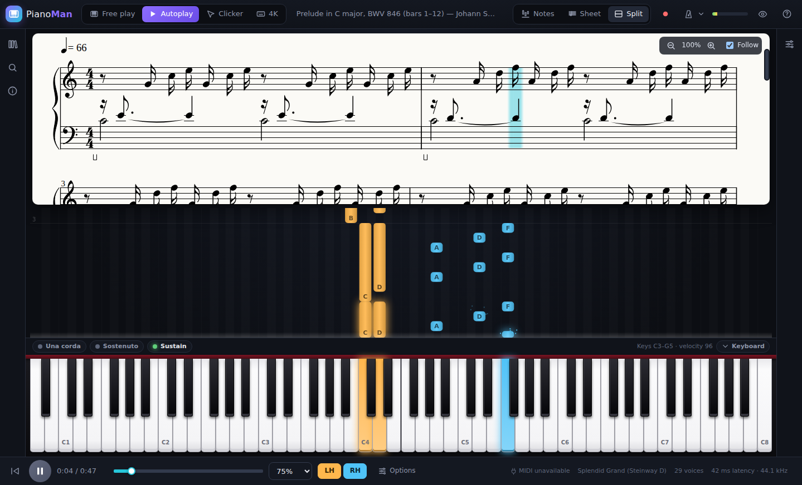
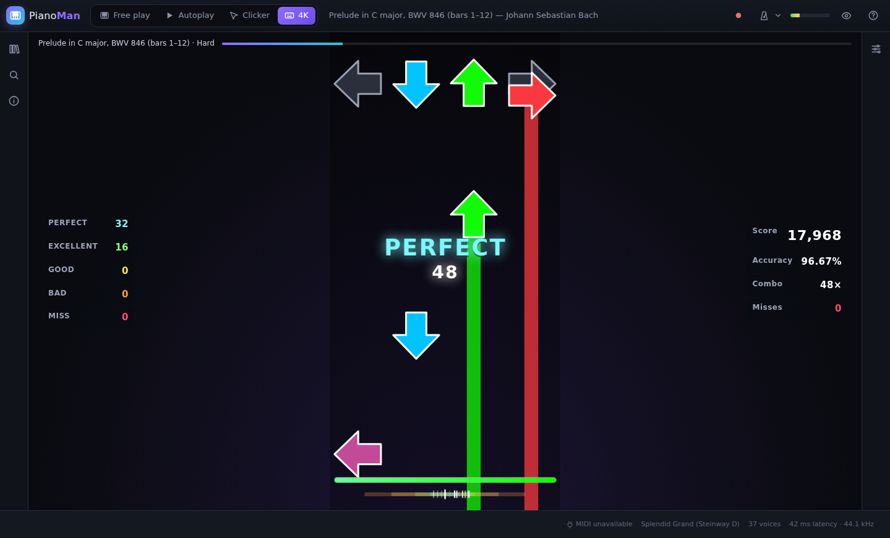
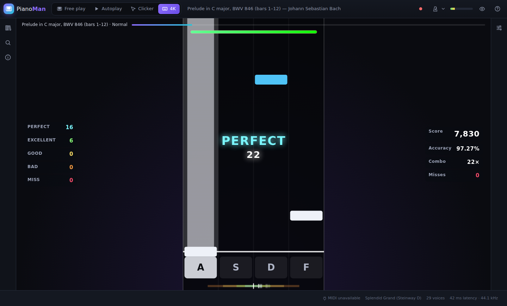
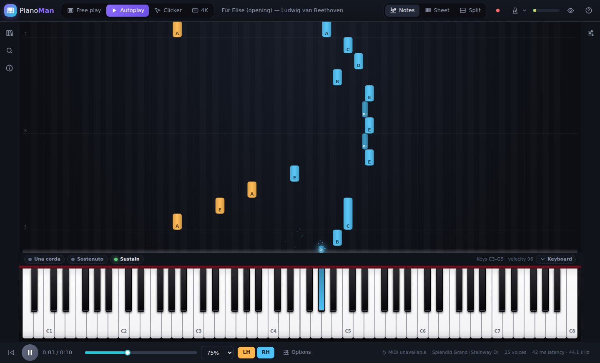
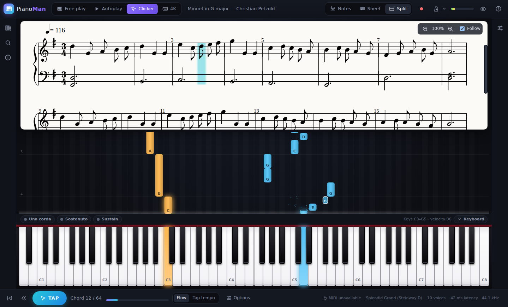
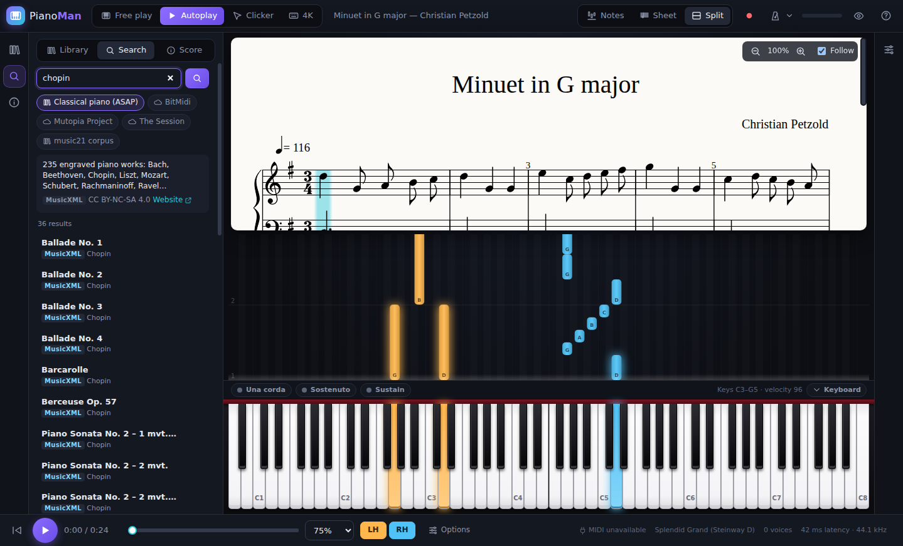
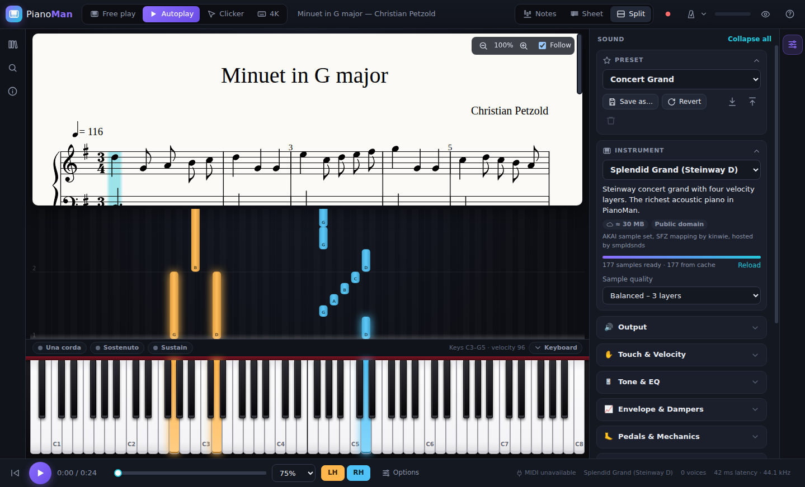

# PianoMan

A desktop piano for Windows, macOS and Linux. It has:

- **Sampled instruments streamed from the internet.** Steinway, Yamaha and Kawai grands, uprights, electric pianos, harpsichord, organs and mallets, with multiple velocity layers. Samples are cached on disk, so each instrument downloads once.
- **A full sound-design panel** covering touch, voicing, dampers, pedals, tuning and temperaments, EQ, room reverb, stereo, effects and dynamics.
- **An autoplayer** for MusicXML, MXL, MIDI and ABC files, with speed control, A–B loops, per-hand practice and a "wait for me" mode.
- **Score search.** Almost 900 classical works are bundled in an offline catalogue, and BitMidi, the Mutopia Project and The Session can be searched online.
- **Sheet music** for every file. MIDI and ABC files get notation generated automatically, and a cursor follows playback.
- **Clicker mode.** Every key press, click or MIDI note drives the score. In **Flow** style the music plays exactly as the autoplayer would for as long as you keep tapping; in **Tap tempo** style each tap plays the next chord.
- **4K rhythm mode.** Any score, including ones you search for, is turned into a four-lane rhythm-game map (default keys `A S D F`) with FNF-style arrows or osu!mania-style bars. Hit the notes to play the piano part, with Perfect / Excellent / Good / Bad / Miss judgements, combo, accuracy, score and grades.
- **A tidy, collapsible layout.** The library and sound panels fold into icon rails, the keyboard folds into a thin strip, and the transport sits at the bottom of the window.



| 4K mode – arrows | 4K mode – bars |
| --- | --- |
|  |  |
| **Falling notes** | **Clicker mode (Flow)** |
|  |  |
| **Search** | **Sound settings** |
|  |  |

---

## Getting started

You need [Node.js](https://nodejs.org) 20 or newer.

```bash
npm install
npm start          # build the UI and launch the desktop app
```

For development with hot reload:

```bash
npm run dev
```

### Building installers

```bash
npm run dist:win    # Windows: NSIS installer + portable .exe
npm run dist:mac    # macOS: .dmg
npm run dist:linux  # Linux: AppImage + .deb
```

Installers are written to `release/`. You can also push a tag such as `v1.0.0`. The **Build installers** GitHub Actions workflow then builds all three platforms and attaches them to a GitHub release. You can start the same workflow by hand from the Actions tab.

> The macOS build is not code-signed. The first time you open it, right-click the app and choose **Open**.

---

## Playing

| Input | How it works |
| --- | --- |
| **Computer keyboard** | Two rows like a tracker. `Z`–`M` is the lower octave, with sharps on `S D G H J`. `Q`–`P` is the upper octave, with sharps on `2 3 5 6 7 9 0`. A single-row layout (`A S D F…`) is available in settings. |
| **Mouse / touch** | Click or tap the on-screen keys. Striking nearer the front of a key plays louder. Drag across the keys for a glissando. Multi-touch works. |
| **MIDI keyboard** | Plug one in at any time. Velocity, sustain (CC64, including half-pedalling), sostenuto (CC66) and soft pedal (CC67) all work. |
| **Pedals** | Hold `Space` (in free play) or `Shift` for sustain. You can also click the pedal buttons above the keyboard to latch them. |

The panic key is `Esc`. `←`/`→` change the octave and `↑`/`↓` change the keyboard velocity. `F1` lists every shortcut.

### Layout

Everything folds away so the music gets the screen:

| Part | How to open or close it |
| --- | --- |
| Library, search and score details | The icons on the left rail, or `Ctrl+B` |
| Sound settings | The icon on the right rail, or `Ctrl+,`. Each section folds on its own, and **Collapse all** folds them all. |
| Keyboard | The **Keyboard** button above it, or `Ctrl+K`. Folded, it becomes a thin strip that still lights up the notes. |
| Transport options (loop, count-in, wait for me, clicker options) | **Options** in the bottom bar |
| Everything at once | The eye icon in the top bar, or `Ctrl+.` (focus mode) |

Play/pause, the timeline and speed are in the bar at the bottom of the window. PianoMan shows a loading screen while it starts and downloads the first samples.

## Instruments & presets

All instruments are free sample libraries hosted on GitHub. PianoMan downloads the samples the first time you pick an instrument and tries a mirror if one host fails. The middle of the keyboard loads first, so you can start playing within a second or two. **Sample quality** (Full, Balanced or Light) controls how many velocity layers are downloaded. With no internet connection, the synthesized piano, electric piano and organ still work.

| Category | Instruments |
| --- | --- |
| Grand pianos | Splendid Grand (Steinway D, 4 layers), Salamander Grand (Yamaha C5), Steinway B (separate pedal-up/pedal-down samples), Kawai Grand, MusyngKite Grand, FluidR3 Bright Grand |
| Upright pianos | Yamaha Upright, Knight Upright (sampled pedal & key mechanics), Honky-tonk |
| Electric pianos | Wurlitzer EP200, Yamaha CP-80, Hohner Pianet T, Tine EP, FM EP, TX81Z |
| Keys & mallets | Flemish Harpsichord, Clavinet, Celesta, Music Box, Vibraphone, Marimba, Glockenspiel, Toy Keyboard |
| Organs | Pipe Organ, Full Church Organ, Drawbar Organ |
| Offline | Synth Piano, FM Tine Piano, Drawbar Organ |

There are 29 factory presets, for example *Concert Grand*, *Felt Piano*, *Lo-fi Keys*, *Honky-Tonk Saloon*, *Suitcase Tines* and *Baroque Harpsichord*. The Baroque Harpsichord preset uses A = 415 Hz and Werckmeister III tuning. You can save your own presets and export or import them as `.json`.

### Sound parameters

| Section | Parameters |
| --- | --- |
| Touch & velocity | Touch curve (light / normal / linear / heavy / fixed), fixed velocity, dynamic range |
| Tone & EQ | Brightness, hammer hardness (velocity-to-timbre), lid position, 3-band EQ with sweepable mid |
| Envelope & dampers | Attack, damper release time, sustain decay, repeated-note behaviour (re-strike cuts or overlaps) |
| Pedals & mechanics | Half-pedalling, sympathetic string resonance, pedal noise, key-release noise, una corda amount |
| Tuning & temperament | A4 reference (415–466 Hz), transpose, fine tune, 8 temperaments with selectable key, stretch tuning, unison detune |
| Room & stereo | 7 reverb rooms (room, studio, chamber, hall, cathedral, plate, spring), amount, RT60, pre-delay, air damping, stereo width, key panning |
| Effects | Tremolo / stereo auto-pan, chorus, drive |
| Dynamics & engine | Compressor (threshold, ratio), output limiter, polyphony |

The piano engine also switches velocity layers, cycles round-robin samples, and leaves the top strings undamped the way a real piano does. It has sostenuto, a metronome with tap tempo, and records what you play to MIDI and WAV.

## Scores

**Open** files with *Open file…* or `Ctrl+O`, drag and drop them onto the window, or double-click one in your file manager (file associations are set up by the installer). **From URL…** loads any direct link. PianoMan reads:

- MusicXML (`.musicxml`, `.xml`) and compressed MusicXML (`.mxl`), including repeats, voltas, D.C./D.S./Fine/Coda, ties, grace notes, tempo changes, dynamics and hairpins, articulations, arpeggios and pedal marks.
- MIDI (`.mid`, `.midi`, `.kar`), including tempo maps and pedal controllers. Zipped multi-movement MIDI downloads also open.
- ABC (`.abc`), including files that contain many tunes; you can pick the tune under **Score**.

**Search** has these sources:

| Source | What | Format |
| --- | --- | --- |
| Classical piano (ASAP) | 235 engraved piano works (Bach, Beethoven, Chopin, Liszt, Mozart, Rachmaninoff, Ravel, …) | MusicXML, bundled index |
| music21 corpus | 650 scores (Bach chorales, Joplin, quartets, …) | MusicXML, bundled index |
| BitMidi | 100,000+ MIDI files | MIDI, online |
| Mutopia Project | 2,000+ public-domain classical scores | MIDI, online |
| The Session | Irish and folk tunes | ABC, online |

Scores you open are saved in your **library**, so they also open offline.

### Autoplay

Autoplay has play/pause, seek, speed from 25 % to 200 %, A–B loop and whole-piece loop, a count-in, and a metronome that follows the score. It also uses the score's pedal marks.

To practise one hand, switch off **LH** or **RH** and play that hand yourself. Its notes are shown as hints. With **Wait for me** on, playback stops at each of that hand's chords until you play them.

### Sheet music

Use the **Sheet** or **Split** view. The cursor follows playback, and clicking a note jumps there. MIDI and ABC files are turned into two-staff notation: rhythms are quantized to 16ths and triplets, notes are tied across bar lines, sustained notes get a second voice, and the key signature is estimated.

### Clicker mode

A tap can be any key, a mouse click on the notes area or the **TAP** button, or any MIDI key. There are two styles, switched in the bottom bar:

- **Flow** (default): the piece plays exactly like the autoplayer, with written rhythms, note lengths, dynamics and pedalling, as long as you keep tapping. Each tap lets the music continue to the next chord. You can tap up to two chords ahead, so mashing keys never makes it rush. When you stop tapping, it waits at the next chord.
- **Tap tempo**: every tap plays the next chord, so the music follows the speed of your taps. The options are:
  - **Taps play**: both hands, or only the right or left hand. With **Other hand follows** on, the other hand plays along at the tempo you are tapping.
  - **Notes last**: as written (scaled to your tapping speed), while the key is held, or until the next tap.
  - **Loudness**: from the score, from your touch, or fixed.

In both styles, `Backspace` steps back one chord and `Home` restarts.

### 4K rhythm mode

Open any score (a demo, your library, a file or a search result) and pick **4K** in the top bar. PianoMan builds a four-lane map from it:

- **Onsets are picked by musical weight.** Downbeats, beats, accents, chords and long notes come first, and each difficulty keeps a minimum gap between notes. Dense passages are therefore thinned out on the beat instead of at random. **Easy** is one note at a time. **Normal**, **Hard** and **Expert** add jumps on strong beats, faster streams and shorter holds.
- **Lanes follow the melody.** Higher notes sit further right, rising lines move right and falling lines move left, and repeated notes stay in their lane unless that would make an unplayable jack.
- **Long notes become holds.** You can turn holds off.
- **Map from**: both hands, or the melody (right hand) only.

Every map note carries the piano notes it stands for. Hit it and they play, lined up with the accompaniment, which plays by itself. Miss it and that note stays silent. An early hit still sounds on the beat.

| Judgement | Window | Accuracy |
| --- | --- | --- |
| Perfect | ±25 ms | 100 % |
| Excellent | ±50 ms | 90 % |
| Good | ±90 ms | 65 % |
| Bad | ±135 ms | 30 % |
| Miss | later than 135 ms, or not hit | 0 % |

The windows are in real time, so they stay the same at any song speed. The score grows with your combo. Grades are **SS** (all Perfect), **S** (95 % or more with no misses), **A** (90 %), **B** (80 %), **C** (70 %) and **D**, or **F** if you fail with *Fail at zero health* on. Your best score for each song and difficulty is saved.

On the song screen you can choose:

- **Notes**: arrows (FNF) or bars (osu!mania).
- **Scroll**: upscroll or downscroll, and scroll speed.
- **Song speed**: 0.5× to 1.5×.
- **Keys**: `A S D F` by default. Click a key to rebind it, or pick a preset: `D F J K`, the arrow keys, or `Z X , .`.
- **Offset**: raise it if you tend to hit late.
- **Options**: hold notes, a miss sound, and failing at zero health.

`Enter` starts or retries, and `Esc` pauses (then `R` restarts and `Q` quits). A MIDI keyboard works too: any four neighbouring white keys map onto the lanes, and you can also tap the lanes on a touch screen.

---

## Where things are stored

| What | Location |
| --- | --- |
| Downloaded samples, scores and search cache | `<userData>/cache` (open it from *Help → Open Sample Cache Folder*; clear it in settings) |
| Library | `<userData>/library` |
| Settings & presets | Browser storage inside the app profile |

`<userData>` is `%APPDATA%\PianoMan` on Windows, `~/Library/Application Support/PianoMan` on macOS and `~/.config/PianoMan` on Linux.

## Project layout

```
electron/          main process (window, app:// protocol, cached network fetch, dialogs, library) + preload
src/audio/         sound engine, instruments, presets, sample loader, tuning, reverb, synth voices, metronome, recorder
src/score/         score model, MusicXML / MXL / MIDI / ABC importers, notation generator
src/player/        autoplayer and clicker mode
src/game/          4K rhythm mode: chart generator, judgement and scoring, play session, game view
src/search/        search providers and the bundled score index
src/ui/            keyboard, falling notes, sheet view, panels, transport, controls
scripts/           instrument-table, score-index and demo generators; dev launcher
test/              unit tests (npm test)
```

Development commands:

```bash
npm run check                      # typecheck + tests + production build
npm run instruments                # rebuild src/audio/data/sfz-instruments.json from the SFZ libraries
python3 scripts/build-score-index.py
node scripts/build-demos.mjs       # regenerate the bundled demo scores
PIANOMAN_CORPUS=/path/to/scores npx vitest run test/corpus.test.ts   # parse a folder of real files
```

## Troubleshooting

- **No sound:** click the window once, because some systems only start audio after an interaction. Also check the output level meter in the top bar.
- **Instrument shows "Offline fallback":** the sample hosts (`*.github.io`, `raw.githubusercontent.com`) were unreachable. Samples that were already downloaded keep working. Otherwise the synth piano plays until you reconnect; then press **Reload**.
- **MIDI keyboard not listed:** connect it and wait a second, since devices are detected while the app runs. On Linux, your user needs access to ALSA MIDI.
- **Linux AppImage:** run `chmod +x PianoMan-*.AppImage` first.

## Credits

Instrument samples (streamed at runtime, not bundled):

- **Splendid Grand Piano**: AKAI (public domain), SFZ by kinwie, hosted by [smpldsnds](https://github.com/smpldsnds)
- **Salamander Grand Piano**: Alexander Holm (CC BY 3.0), via [Tone.js audio](https://github.com/Tonejs/audio)
- **Versilian Community Sample Library** (Steinway B, Kawai, uprights, harpsichord, organ, mallets, TX81Z): Sam Gossner (CC0)
- **Greg Sullivan E-Pianos** (Wurlitzer, CP-80, Pianet): Greg Sullivan (CC BY 3.0)
- **FluidR3 GM** (CC BY 3.0) and **MusyngKite** (CC BY-SA 3.0) soundfonts, via [midi-js-soundfonts](https://github.com/gleitz/midi-js-soundfonts)

Scores come from the [ASAP dataset](https://github.com/fosfrancesco/asap-dataset) (CC BY-NC-SA 4.0), the [music21 corpus](https://github.com/cuthbertLab/music21), [BitMidi](https://bitmidi.com), the [Mutopia Project](https://www.mutopiaproject.org) and [The Session](https://thesession.org), and belong to their respective sources.

Libraries: [OpenSheetMusicDisplay](https://opensheetmusicdisplay.org) & VexFlow, [abcjs](https://abcjs.net), [@tonejs/midi](https://github.com/Tonejs/Midi), [fflate](https://github.com/101arrowz/fflate) and [Electron](https://electronjs.org).

PianoMan itself is MIT licensed.
